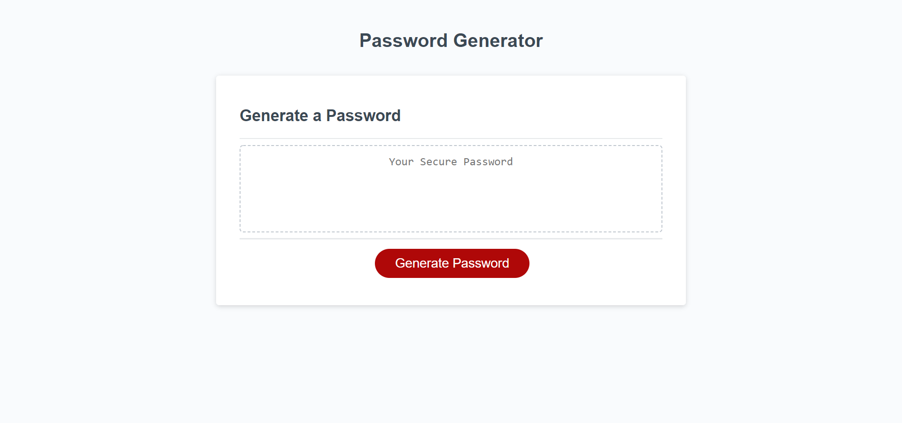
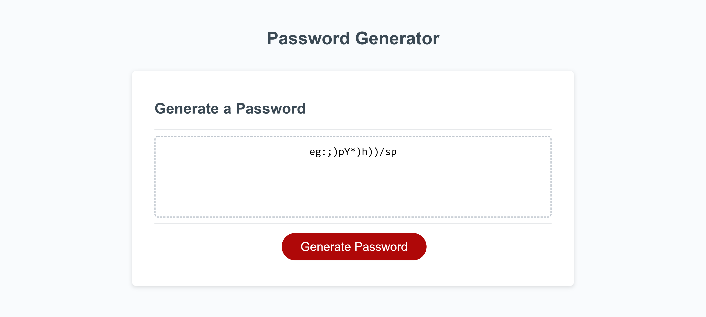

# password-generator

## Objective

``` 

My objective for this assignment was to generate a random password based on a users preference. The following tasks is how I accomplished that objective:
* Setting up a function that contains nested functions. The purpose of the overarching function is to execute each nested function with a single call.
* Within the overarching function were seperate functions that would prompt the user to choose certain character types. If chosen, the corresponding character type would be pushed into an empty array.
* The new array has a random number generator that chooses certain index values which are then displayed as the users random password. 

```

---

## Final Page Screenshot



## Final Page Link
- [Deployed webpage](https://eugene125.github.io/password-generator/)
- [GitHub Respository](https://github.com/eugene125/password-generator)

## Technologies Used
- HTML
- CSS
- JavaScript

## License

This code is licensed under the MIT License